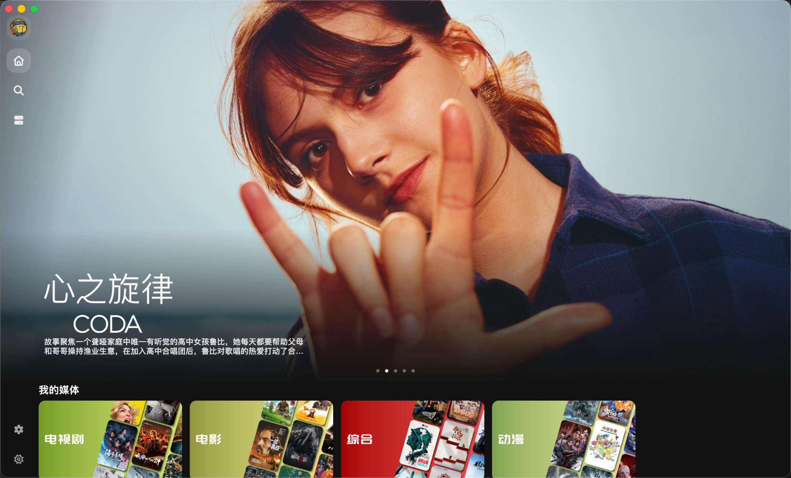

  

# Themby

第三方 Emby 播放器

    <a title="Download" href="https://github.com/chicring/Themby/releases" target="_blank">
    下载应用
    </a>
    |
    <a title="Source Code" href="https://github.com/chicring/Themby/tree/dev" target="_blank">源代码</a>

> [!NOTE]
> 此仓库目前仅用于分发，源代码请切换到 [dev 分支](https://github.com/chicring/Themby/tree/dev)

## 总览

Themby 是一个支持多平台的媒体播放器。

> [!TIP]
> 项目目前还在完善中，欢迎提出建议和反馈。

## 截图

  
  
  

